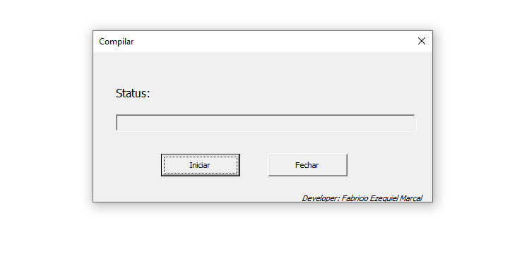

# VBA-Relatorios-Termografia

## Descrição
Estes são códigos visual basic for aplications, que realizam uma pré montagem automática de relatorios de modelos predefinidos termografia em puramente microsoft word com ligação em graficos excel.
precisam de muitas revisões ainda mas ja realizam a maioria das tarefas.
